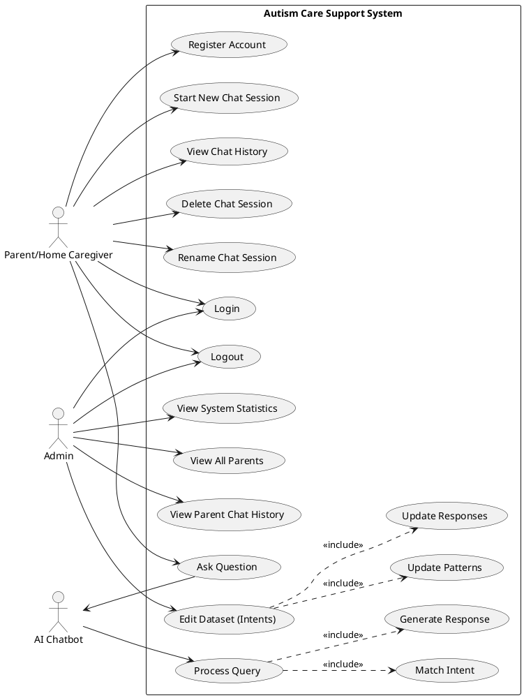
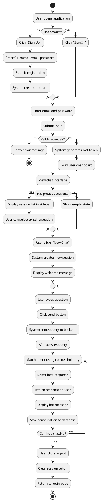
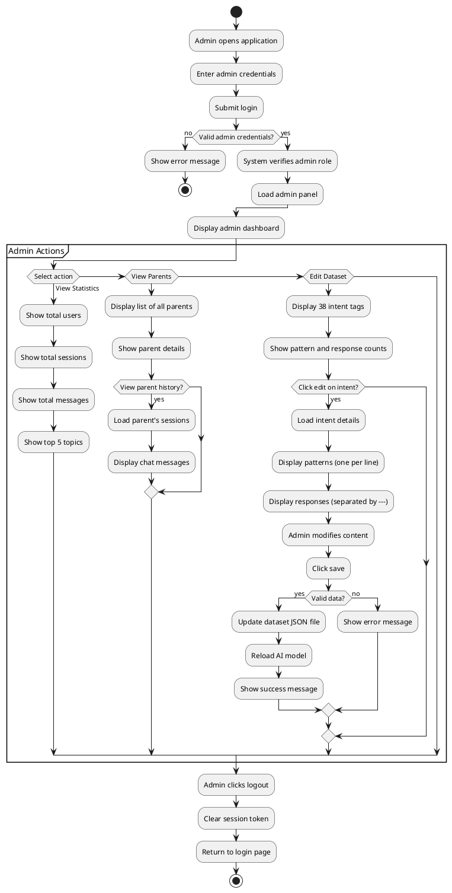
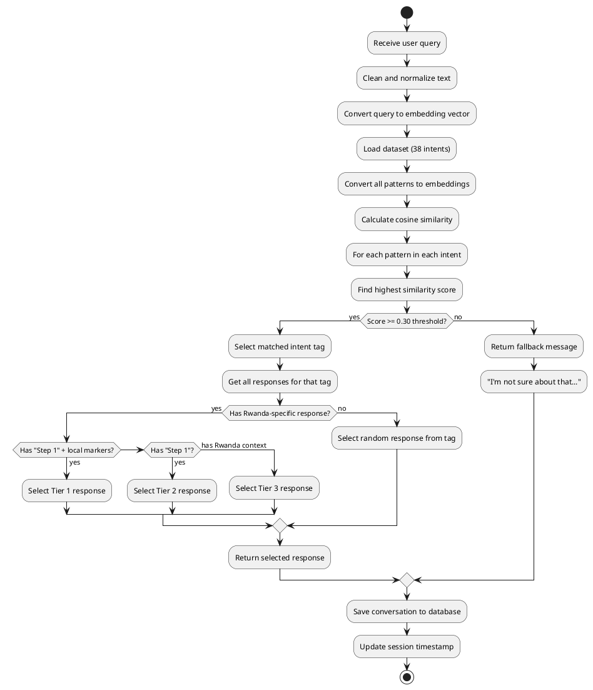

# System Diagrams for Autism Care Support System

## How to Use These Diagrams

Copy the code for each diagram and paste it into the appropriate online tool:

- **Use Case Diagram**: https://www.plantuml.com/plantuml/uml/
- **DFD (Data Flow Diagram)**: https://app.diagrams.net/ (draw.io)
- **Flowchart**: https://www.plantuml.com/plantuml/uml/ or https://app.diagrams.net/

---

## 1. USE CASE DIAGRAM

### PlantUML Code (paste at https://www.plantuml.com/plantuml/uml/)

---

## 2. DATA FLOW DIAGRAM (DFD) - Level 0 (Context Diagram)

### Description for draw.io (https://app.diagrams.net/)

**Entities:**
- Parent/Home Caregiver (external entity - rectangle)
- Admin (external entity - rectangle)

**System:**
- Autism Care Support System (circle in center)

**Data Flows:**
- Parent → System: Registration data, Login credentials, Questions/queries
- System → Parent: Chat responses, Session history, Authentication token
- Admin → System: Login credentials, Dataset updates (patterns/responses)
- System → Admin: System statistics, User list, Chat histories, Authentication token

---

## 2. DATA FLOW DIAGRAM (DFD) - Level 1 (Detailed)

### Description for draw.io

**Processes (circles):**
1. Authentication Process
2. Chat Management Process
3. AI Query Processing
4. Admin Management Process
5. Dataset Management Process

**Data Stores (parallel lines):**
- D1: Users Database
- D2: Sessions Database
- D3: Conversations Database
- D4: Dataset JSON File

**External Entities (rectangles):**
- Parent/Home Caregiver
- Admin

**Data Flows:**

From Parent:
- Parent → Process 1: Login/Register data
- Parent → Process 2: New session request, Session selection
- Parent → Process 3: User question

From Process 1:
- Process 1 → D1: Store/verify user credentials
- Process 1 → Parent: Authentication token

From Process 2:
- Process 2 → D2: Create/update session
- Process 2 → D3: Retrieve messages
- Process 2 → Parent: Session list, Chat history

From Process 3:
- Process 3 → D4: Read patterns/responses
- Process 3 → D3: Store conversation
- Process 3 → Parent: AI response

From Admin:
- Admin → Process 1: Login credentials
- Admin → Process 4: View stats/users request
- Admin → Process 5: Dataset edit request

From Process 4:
- Process 4 → D1: Read users
- Process 4 → D2: Read sessions
- Process 4 → D3: Read conversations
- Process 4 → Admin: Statistics, User list, Chat histories

From Process 5:
- Process 5 → D4: Update patterns/responses
- Process 5 → Admin: Updated dataset

---

## 3. SYSTEM FLOWCHART - Parent User Flow

### PlantUML Code

---

## 4. SYSTEM FLOWCHART - Admin User Flow

### PlantUML Code

---

## 5. AI QUERY PROCESSING FLOWCHART

### PlantUML Code

---

## Instructions for Creating Diagrams

### For PlantUML diagrams (Use Case, Flowcharts):
1. Go to https://www.plantuml.com/plantuml/uml/
2. Copy the code block (including @startuml and @enduml)
3. Paste it into the text area
4. Click "Submit" or the diagram will auto-generate
5. Download as PNG or SVG using the download button

### For DFD (Data Flow Diagram):
1. Go to https://app.diagrams.net/
2. Create a new diagram
3. Use the shapes from the left panel:
   - **Circles/Ovals** for processes
   - **Rectangles** for external entities
   - **Parallel lines** (or open rectangles) for data stores
   - **Arrows** for data flows
4. Follow the descriptions above to draw Level 0 and Level 1 DFDs
5. Label all elements clearly
6. Export as PNG or PDF

### Alternative: Use Microsoft Visio or Lucidchart
If you have access to these tools, you can also create professional diagrams there using the same structure described above.

